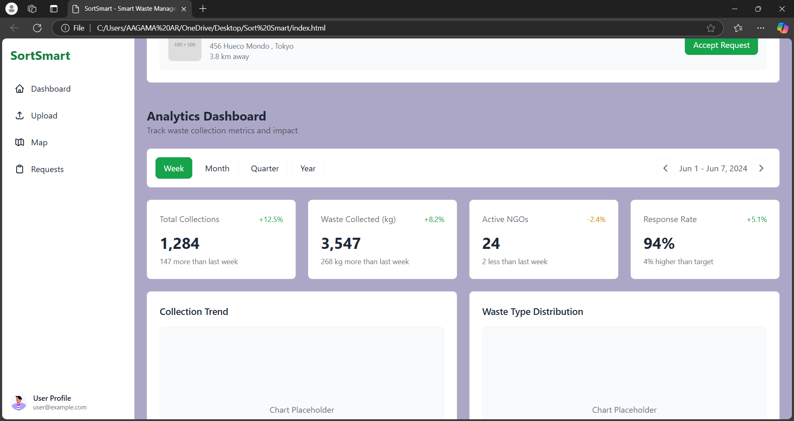

# [Sort Smart 🎯

## Basic Details
### Team Name: [Sugar and Code]

### Team Members
- Member 1: [Aagama AR] - [MEC]
- Member 2: [Aarushi Dalmia] - [MEC]

### Hosted Project Link
[https://aagamaar.github.io/SORT-SMART/]
### Project Description
[Waste collection and reporting by sending pictures real time.]

### The Problem statement
[Clearing up waste in the town by getting it collected by NGOs nearby]

### The Solution
[The user clicks a picture and uploads on this site, notifying the nearby NGOs and scrap collectors who would collect the waste and dispose]

## Technical Details
### Technologies/Components Used
For Software:
- [HTML  and CSS]

# Screenshots (Add at least 3)
]
*shows the details of how much waste has been collected* 

]
*dashboard displaying the recent requests updated*

]
*place to upload the picture of the waste and describing it*

## Team Contributions
- [Aagama AR]: [front end]
- [Aarushi Dalmia]: [design]

---
Made with ❤️ at TinkerHub
